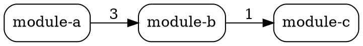
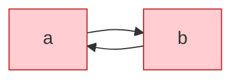

# 의존성 그래프 출력 규약

## DOT (Graphviz)

- `rankdir=LR` 좌→우
- 엣지 라벨 = import 라인 수
- 순환 SCC 노드는 `color=red, fontcolor=red`

## Mermaid

순환 강조:

## In-degree / Out-degree 해석

- **In-degree 높음** = 많은 모듈이 이 모듈에 의존 → 핵심 라이브러리, 변경 시 영향 범위 큼
- **Out-degree 높음** = 이 모듈이 많은 모듈에 의존 → 통합 레이어 (예: API Gateway)
- **In + Out 모두 높음** = God class 가능성

## 출력 파일 위치

- `dependency-graph.dot` (Graphviz 변환용 — `dot -Tsvg in.dot > out.svg`)
- `dependency-graph.mmd` (Mermaid — GitHub/Notion 직접 렌더링)
- `dependency-graph.json` (raw, 다른 도구 입력용)
