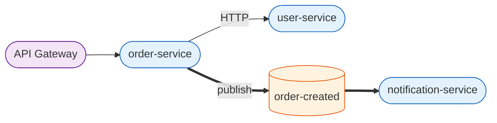
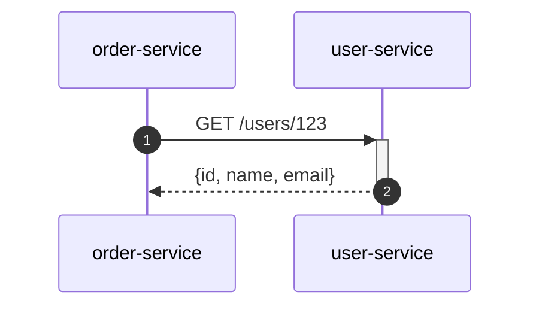
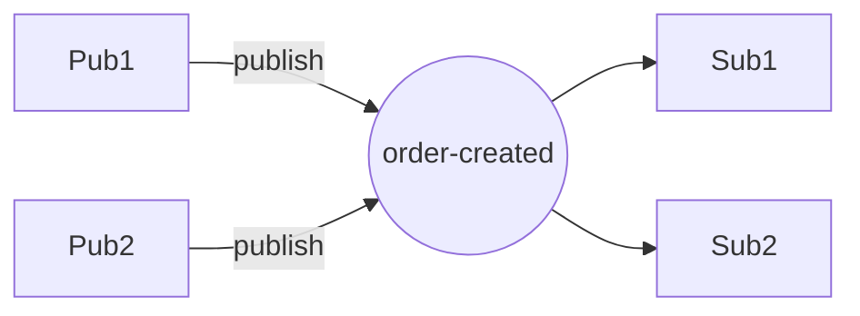

# MSA 다이어그램 규약 (Mermaid)

## 1. C4 컨테이너 다이어그램 (`msa/00-overview.md`)

규칙:
- 서비스: `([service-name])` + `:::service` 클래스
- 토픽: `[(topic-name)]` + `:::topic` 클래스
- HTTP 호출: `--` 일반 화살표
- 이벤트 publish/subscribe: `==>` 굵은 화살표

## 2. 시퀀스 다이어그램 (`msa/api-calls/*.md`, `msa/sequence-diagrams/*.mmd`)

규칙:
- `autonumber` 항상 포함
- caller는 좌측 (`participant C`)
- 동기 호출: `->>+ ... -->>-`
- 비동기 발행: `--)` (점선)

## 3. 이벤트 흐름 (`msa/events/*.md`)

규칙:
- 토픽은 원형 노드 `(("topic-name"))`
- publishers는 좌측, subscribers는 우측
- 멀티 publisher / 멀티 subscriber 모두 표시

## 4. 서비스 의존성 매트릭스

Markdown 표 사용 (Mermaid 부적합).
- 행: caller, 열: callee
- 셀: 호출 라인 수, 0이면 `-`
