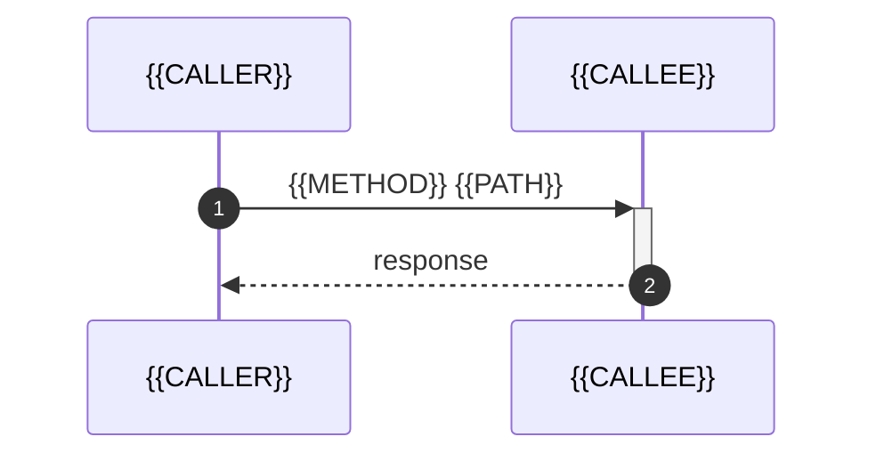

# {{CALLER}} → {{CALLEE}}: {{METHOD}} {{PATH}}

- **Caller**: `{{CALLER}}` (`{{CALLER_FILE}}`)
- **Callee**: `{{CALLEE}}`
- **Protocol**: {{PROTOCOL}}
- **Method**: {{METHOD}}
- **Path / RPC**: `{{PATH}}`
- **Client**: {{CLIENT_LIB}} ({{LANGUAGE}})
- **Sync/Async**: {{SYNC_ASYNC}}

## Mermaid Sequence



## 호출 컨텍스트

```{{LANGUAGE}}
{{CODE_EXCERPT}}
```

## 점검 항목

- [ ] Timeout 설정 명시 여부
- [ ] Retry 정책 (Resilience4j / Spring Retry / 없음)
- [ ] Error handling (try-catch / onErrorResume / .catch)
- [ ] Circuit breaker 적용 여부
- [ ] Tracing/Correlation ID 전파 여부
- [ ] Authentication/Authorization 헤더 전파
